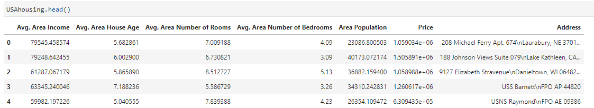
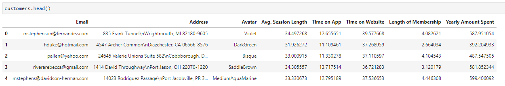

# Linear-Regression

# DataFrames

Explore these correlation relationships across the entire data set. Use pairplot to recreate the plot.

Training and Testing Data

Training the Model

Create an instance of a LinearRegression() model named lm

Print out the coefficients of the model

Predicting Test Data

Evaluating the Model

Residuals
